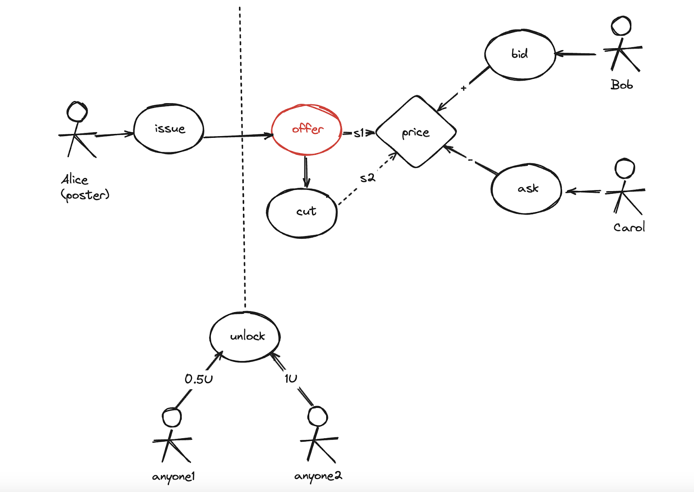

# Welcome to Zeek Contract

Welcome to Zeek Contract, Zeek is a Dapp buiding on OSP ecosystem.

## Contract Architecture

### Contract Role
- APP_ADMIN
  - 赋予地址角色权限
- GOVERNANCE
  - 设置plugin合约的白名单
  - 更换财务账户地址
- OPERATION
  - 设置合约相关参数与配置
- ZEEK
  - 中心化验证签名者
- Finance
  - 财务地址

### Wish
#### Overview


#### Actors
- **Wish Issuer**
Who did the first wish publishing, and also the first owner of this wish.
Who will do the offer action for the bounty
- **Wish Participants**
  - **Wish Owner**
    Who has the befinet from the wish unlcok, and trading behevior.
  - Linker
    Who will refer the bounty to potential talents
  - Talent
    Who will do the application action for the bounty

#### Structs
WishStruct is the core struct for zeek contract. Each individual wish will be described as WishStruct in this contract. All the wishes can be managed in contract by the mapping storage.
```solidity
mapping(unit => WishStruct); // A mapping of wishIDs to wishes
```

- WishStruct
```solidity
  struct WishStruct {
    uint256 issuer; // An indiviual who is the intial issuer of the wish
    uint256 owner; // An individuals who have complete control over the wish
    WishType wishType; // enum: Question, Referral
    bool restricted; // true: all answers not visible
    WishTokenValue price; // current pricing for this wish
    TokenValue quote; // current quote pricing for this wish
    WishState state; // active, closed, finished
    mapping(OfferType => OfferRatio) offerRatios; // key to related to Offer::type, value for OfferRatio
    uint64 start; // wish excatly start time
    uint64 deadline; // The Unix timestamp before which all answers must be made
    uint64 timestamp; // wish start time i.e. the chain transaction occur timestamp
    uint64 modifyTime; // wish modify time
    uint64 finishTime; // wish finished time, for both close and finish states
    Offer[] offers; // Offers - one wish might be offer when transferred to new owner. But currently it should be only one.
    mapping(uint256 => Unlock) unlocks; // unlocker profile -> Unlock
  }

  struct Offer {
      uint256 talent;
      uint256 linker;
      uint256 applyNonce;
      uint64 applyTime;
      uint64 timestamp;
  }

  struct Unlock {
      address token;
      uint tokenVersion;
      uint256 value;
      uint64 timestamp;
  }

```

#### Wish States
- Draft (*Off-Chain*)
Draft stands for the off-chain bounty data before publishing to chain.
Bounty owner free to create and modify the bounty information and also including the off-chain part  like offer conditions.

- Active (*On-Chain*)
The state changed to open once bounty is published on-chain. Meanwhile, the bonus is already locked in this contract.

- Close (*On-Chain*)
Bounty owner has the ability to terminate the bounty prematurely.
But still need to contribute the service fee once the transaction approved.

- Finished (*On-Chain*)
Bounty approver approved the bounty with offer information. 
Every role in this transaction will get distributed the tokens automatically.

#### Wish Senarioes


#### Methods
- issueWish
permission: anyone wish minimal staking amounts
```solidity
    function issueWish(
        ZeekDataTypes.WishIssueData calldata data
    ) external payable returns (uint);
```

| 要素      | 变更 |
| ----------- | ----------- |
| **Validation** | salt不重复，传入与授权数量，最小的问题奖金，wish时间 |
| **Storage** |  新增wish对象 |
| **Token** | 锁定 |
| **Event** | WishIssued |

- issueWishPlug
permission: contract in whitelist can call the issue wish
```solidity
    function issueWishPlug(
        ZeekDataTypes.WishIssueData calldata data,
        address issuer
    ) external payable returns (uint256);
```

- offerWish
permission: issuer
offer wish to the best answer
```solidity
    function offerWish(
        ZeekDataTypes.WishApplyData calldata vars,
        ZeekDataTypes.EIP712Signature calldata applySig
    ) external;
```

| 要素      | 变更 |
| ----------- | ----------- |
| **Validation** | 申请人签名验证 |
| | owner身份验证 |
| | 状态验证Active |
| | 申请人和推荐人是否有zeek profile身份 |
| **Storage** |  状态修改 |
| **Token** | 按比例发给 talent(best offer) 和zeek |
| **Event** | WishOffered 如果未来有多个offer的话，发出多个事件 |

- unlockWish
```solidity
    function unlockWish(
        ZeekDataTypes.WishUnlockData calldata data
    ) external payable;
```
| 要素      | 变更 |
| ----------- | ----------- |
| **Validation**      | 解锁人是否有zeek profile |
| | 是否解锁过 |
| **Storage** |  新增wish的unlock记录 |
| **Token** | 按比例发给issuer, owner, talent, zeek |
| **Event** | WishUnlocked |
| | Vaulted (3笔）for: issuer, owner, talent |


- bidWish
Trading wish with bid price
```solidity
function bidWish(ZeekDataTypes.WishBidData calldata data) external payable;
```

| 要素      | 变更 |
| ----------- | ----------- |
| **Validation**      | 状态验证，Finished状态。offer后       |
| | 吃单人，需要拥有zeek profile        |
| | 验证资金 |
| **Storage** |  更新owner为Bob |
| | 价值升值10% |
| | 最后修改时间 |
| **Token** | 直接转给owner Alice 105% |
| | 1%给best anwer（vaulted） |
| | 4%给平台 |
| **Event** | WishBidded |
| | Vaulted (1笔）only for talent (best answer) |

- askWish
Trading wish with ask price which is set by current wish owner
```
function askWish(ZeekDataTypes.WishAskData calldata data) external payable;
```

| 要素      | 变更 |
| ----------- | ----------- |
| **Validation**      | 状态验证，Finished状态。offer后       |
| | 接单人，需要拥有zeek profile        |
| | 验证资金 |
| **Storage** |  更新owner为Carol |
| | 价格更新为quote的价格 |
| | 清空quote的价格 |
| **Token** | 直接转给prior owner 100%, let's say Alice |
| **Event** | WishAsked |


- cutWish
permission: wish owner
Set the ask price by current wish owner
```
function cutWish(ZeekDataTypes.WishCutData calldata data) external;
```
| 要素      | 变更 |
| ----------- | ----------- |
| **Validation**      | 执行人owner身份验证 |
| | Wish状态验证 Finished。offer后 |
| | 最小数额校验 |
| | 价格不能大于当前价格校验 |
| **Storage** |  更新报价 |
| | 最后修改时间 |
| **Event** | WishCutted |

- modifyWish (upcoming)
permission: owner
Modify is similar to issue.
But can increase or decrease the bonus by modify.

- refundWish (upcoming)
permission: owner
```solidity
function refundWish(ZeekDataTypes.WishRefundData calldata data) external;
```


### Governance
Whis is desinged to manage the contract setting.

### Profile
Zeek User Profile

- createProfile
```solidity
function createProfile(uint256 salt) external returns (uint256);
```

- claim

claim all personal vaults

```solidity
function claim(address token) external;
```

- vault
read the user's vault

```solidity
function vault(address owner, address token) external view returns (uint256 claimable, uint256 claimed, uint64 timestamp);
```

***

## Foundry

*Foundry is a blazing fast, portable and modular toolkit for Ethereum application development written in Rust.*

**Documentation**: https://book.getfoundry.sh/

Foundry consists of:

-   **Forge**: Ethereum testing framework (like Truffle, Hardhat and DappTools).
-   **Cast**: Swiss army knife for interacting with EVM smart contracts, sending transactions and getting chain data.
-   **Anvil**: Local Ethereum node, akin to Ganache, Hardhat Network.
-   **Chisel**: Fast, utilitarian, and verbose solidity REPL.

## Usage
forge install OpenZeppelin/openzeppelin-contracts --no-commit
forge install OpenZeppelin/openzeppelin-contracts-upgradeable --no-commit

### Build

```shell
$ forge build
```

### Test

```shell
$ forge test
```

### Format

```shell
$ forge fmt
```

### Gas Snapshots

```shell
$ forge snapshot
```

#### Remix调用
---- remix调用成功，参数列表
["0",["0x0000000000000000000000000000000000000000","0","100000000000000"],["0x0000000000000000000000000000000000000000","0","0"],"1704038400","1735574400","410006"]
"0xaA55DeE8De61173E6Bc4f6231C7bD42E1a7DcA53"


```shell
$ forge --help
$ anvil --help
$ cast --help
```


// TODO
// 1. IPFS & baseUri
// 2. 合约升级


# Guides

## 1）导出ABI
导出三个合约的method-identifiers：
```
forge inspect Profile mi > ./script/identifiers/Profile.json
forge inspect Governance mi > ./script/identifiers/Governance.json
forge inspect Wish mi > ./script/identifiers/Wish.json

```
## 2）发布脚本
* Dev 发布
```
forge script script/ZeekRouterDeploy.s.sol --rpc-url $BASE_SEPOLIA_RPC_URL --private-key $PRIVATE_KEY --broadcast
```

* AWS KMS方式发布 (Pre/Prod)
```
forge script script/ZeekRouterDeploy.s.sol --rpc-url $BASE_RPC_URL --aws --sender $KMS_DEPLOYER --broadcast
```

## 3）设置脚本
* Dev 发布
```
forge script script/ZeekSetup.s.sol --rpc-url $BASE_SEPOLIA_RPC_URL --private-key $PRIVATE_KEY --broadcast
```

* AWS KMS方式发布 (Pre/Prod)
```
forge script script/ZeekSetup.s.sol --rpc-url $BASE_RPC_URL --aws --sender $KMS_DEPLOYER --broadcast
```

## 4）升级脚本
* Dev 发布
```
forge script script/ZeekRouterUpgrade.s.sol --rpc-url $BASE_SEPOLIA_RPC_URL --private-key $PRIVATE_KEY --broadcast
```

* AWS KMS方式发布 (Pre/Prod)
```
forge script script/ZeekRouterDeploy.s.sol --rpc-url $BASE_RPC_URL --aws --sender $KMS_DEPLOYER --broadcast
```

## 5）测试脚本
以测试某个测试类的测试方法为例
```
forge test --match-contract BountyTest --match-test testCannotOfferBounty_Token0FeeToken0_manyTimes
```

# KMS

replace 
```
--private-key $PRIVATE_KEY
```
to 
```
--aws --sender $KMS_DEPLOYER
```


# 其他资料
## 1）连接remixd测试
```
remixd -s .
```

## 2) 验证合约 Contract Verify


-- TODO beta missing
-- "issueWishPlug((uint8,(address,uint256,uint256),(address,uint256,uint256),uint64,uint64,uint256),address)": "add"
-- "whitelistApp(address,bool)": "add"
-- "acceptWishApply((uint256,address,address,uint64))": "remove",
-- "acceptWishApply((uint256,address,address,uint64,uint256))": "add",
-- "offerWish((uint256,address,address,uint64),(bytes,uint64))": "remove",
-- "offerWish((uint256,address,address,uint64,uint256),(bytes,uint64))": "add"

# 合约资源
* 临时记录

| env  | chain     | contract address |
|------|-----------| ----  |
| dev  | *sepolia* | 0x117BECe63794d7D135933C7E748515fFB9b39ff9 |
| dev  | *polygon mumbai* | 0x6c33A2BA25eBf93fd1292fEFA6bf136447Fc6c58 |
| beta | *sepolia* | 0xE1594714698a8b7CA25bcf4c309756868c5A0249 |
| beta | *polygon mumbai* | 0xE9291F1Ce3F7e34626660E9AB054D93eA8f1A33d |
|alpha | *polygon mumbai* | 0x0e7B24696b7334140222773066BD06609c697EE0 |

测试插件用的dev合约地址: 0x8F39f1ce729dBb2De7356eBCA04381986e6C9941

mumbai (_Abandon Now_)
USDT：https://mumbai.polygonscan.com/address/0x4A90D5aE01F03B650cdc8D3A94358F364D98d096#writeContract
USDC：https://mumbai.polygonscan.com/address/0xcfFE58F09FfB9d4AE5f92449EA4aC75edD87e779#writeContract


# Cast Transfer
* Native Token
```
cast send --aws $TO_ADDRESS --value 0.0001ether --rpc-url $BASE_RPC_URL
```

* ERC20 Token
```
cast send 0x833589fcd6edb6e08f4c7c32d4f71b54bda02913 "transfer(address,uint256)" $TO_ADDRESS 100000000 --aws --rpc-url $BASE_RPC_URL
```


